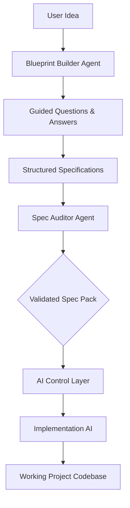

# 🛠️ AI-Assisted Project Specification Engine

> **"Idea → Architecture → Domain → Specs → Code"** — *Because random code leads to architectural chaos.*

## 🌟 Overview

This is a structured framework designed to convert software product ideas into **implementation-ready specifications**. 

Unlike traditional AI coding approaches that jump straight from a prompt to code, this engine enforces a **Specification-First** methodology.

The goal is to move from **User Idea** to a **Validated Spec Pack**, ensuring that when the "Implementation AI" finally writes code, it does so within a strictly defined, validated, and consistent architectural boundary.

---

## 🚀 The Pipeline

The system operates through a multi-layered pipeline that separates **Product Design** from **Code Generation**.



---

## 🏗️ Core Architecture

The project is divided into three critical layers:

### 1️⃣ Layer 1: Blueprint Generator (`BLUEPRINT_BUILDER_AGENT.md`)
An orchestrator that guides the user through a conversational process to extract knowledge and generate documentation. It never writes code; it only builds **blueprints**.

### 2️⃣ Layer 2: Spec Validation (Optimization)
A secondary validation layer (Spec Auditor) that ensures consistency across all generated documents before implementation begins.

### 3️⃣ Layer 3: AI Control Layer (`ai_control_layer/`)
A set of strict guardrails, prompts, and rules that dictate how an implementation agent must behave. It prevents "hallucinated architecture" by forcing adherence to the Spec Pack.

---

## 📂 Project Structure

This repository is organized to separate the **Generation**, **Validation**, and **Control** layers of the software lifecycle.

```text
.
├── BLUEPRINT_BUILDER_AGENT.md  # Layer 1: The AI CTO orchestrator (Guided Spec Builder)
├── SPEC_AUDITOR_AGENT.md       # Layer 2: The Spec Auditor (Validates consistency)
├── README.md                   # Main documentation
├── ai_control_layer/           # Layer 3: Guardrails for AI Implementation agents
│   ├── AI_ALLOWED_FILES.md     # Files the AI is allowed to modify
│   ├── AI_IMPLEMENTATION_RULES.md # Coding standards and forbidden practices
│   └── ... (workflow, prompt, and validation protocols)
└── Specs/                      # THE SPEC PACK (Generated interactively)

```


### Specs Final Result

└── Specs/  
| Stage | File | Contains |
|-------|------|----------|
| 1 | `PROBLEM_STATEMENT.md` | Why this product exists |
| 2 | `MARKET_SCOPE.md` | Target market |
| 3 | `VALUE_PROPOSITION.md` | Unique selling points |
| 4 | `PRODUCT_OVERVIEW.md` | System functions and actors |
| 5 | `MVP_SCOPE.md` | V1 vs V2 vs Out of Scope |
| 6 | `USER_FLOWS.md` | Step-by-step user journeys |
| 7 | `FRD.md` | Functional requirements |
| 8 | `DOMAIN_SOURCE_OF_TRUTH.md` | Entity relationships |
| 9 | `ENTITY_DEFINITIONS.md` | Field-level specs for all entities |
| 10 | `STATE_MACHINE_SPEC.md` | Subscription/Payment lifecycles |
| 11 | `EVENT_MATRIX.md` | Triggers and side effects |
| 12 | `ARCHITECTURE_PLAN.md` | Tech stack and infrastructure |
| 13 | `SERVICE_LAYER_SPEC.md` | Business logic methods |
| 14 | `DB_SCHEMA.sql` | MySQL schema |
| 15 | `BACKEND_IMPLEMENTATION_CONTRACT.md` | Never-break development rules |
| 16 | `TDD_TESTING_GUIDE.md` | Testing strategy |
| 17 | `IMPLEMENTATION_PLAN.md` | 4-phase development roadmap |
| 18 | `FINAL_BLUEPRINT.md` | Summary and sign-off |

## 💡 Why This Approach?

Most AI coding failures stem from a lack of context and structure.
*   **Traditional Flow:** User Prompt → AI writes random code → **Architectural Chaos.**
*   **Blueprint Flow:** User Idea → Structured Specs → Validated Spec Pack → **Controlled Implementation.**

By separating **Specification** from **Implementation**, we eliminate the most common source of error: the AI "inventing" architecture on the fly.

---

## 🛠️ How to Get Started

You can use the included `BLUEPRINT_BUILDER_AGENT.md` to have an AI assistant help you build out the entire blueprint interactively.
1.  **Initialize the Builder**: Tell your AI Assistant:
    > *"Follow the instructions in `BLUEPRINT_BUILDER_AGENT.md` and start the blueprint process. 
    Begin with Stage 1."*

2.  **Iterate**: Respond to the guided questions for each stage.

    The AI will then start the interactive process:

    ```text
    Stage 1 — Problem Definition

    Question 1:
    What problem are you trying to solve?
    ```

    The agent will ask you questions step-by-step and incrementally construct the entire project documentation alongside you.

3.  **Audit**: Once the Spec Pack is complete, use an Auditor to verify consistency.
    ```text
    "Read SPEC_AUDITOR_AGENT.md and audit the Spec folder completely."
    ```

4.  **Implement**: Hand over the **Spec Pack + AI Control Layer** to an implementation agent to begin coding.
    At this time, we are done with this blueprint process and you got all specs generated by the blueprint builder agent, so you can use your favorite IA to implement the project using the Spec Pack and AI Control Layer if you want.

---

## 🎯 Final Goal
To produce an **Implementation-Ready Contract** that is so detailed and consistent that any AI (or human) can build the codebase with zero ambiguity.

**Result:**
This agent effectively converts a raw idea into a complete software specification:
`Idea` → `Structured Questions` → `Blueprint Documents` → `Architecture` → `Backend Spec` → `Implementation Pack`

---

## 🌐 Alternative Web Chat Option

If you prefer a locally manageable web interface instead of working directly with a cli or IDE, check out **[Proyect Blueprint Builder — Web Chat](https://github.com/odonline/ai-proyect-blueprint-builder-web-chat)**. It provides a web-based chat experience as an alternative option to build your project blueprint, opensourced, and you can run it locally or deploy it on your own server.
